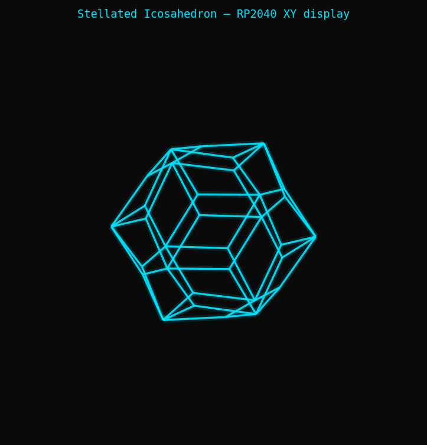

# xy-icosaedro

RP2040 firmware that renders a stellated icosahedron on an analog oscilloscope used as an XY vector display. The RP2040 streams stereo audio via a PIO-driven I2S DAC at 96 kHz — left/right channels drive the X and Y deflection inputs. A third digital output (GP5) controls beam blanking during flyback. The icosahedron has 12 base vertices, 20 animated spikes (one per face, oscillating in and out with distributed phases), and 60 edges total. All three rotation axes advance at golden-ratio-derived speeds to produce a non-repeating trajectory.

## Hardware wiring

| RP2040 pin | Signal | Destination |
|---|---|---|
| GP2 | I2S BCLK | DAC BCLK |
| GP3 | I2S LRCLK | DAC LRCLK |
| GP4 | I2S DIN | DAC DIN |
| GP5 | Z blanking | Oscilloscope Z input |

DAC left output → oscilloscope X input  
DAC right output → oscilloscope Y input

## Build

```
mkdir -p tmp/build && cd tmp/build
cmake ../.. -DCMAKE_TOOLCHAIN_FILE=../../toolchain-xpack.cmake
make -j$(nproc)
```

Flash: use the `/flash-ico` slash command, or run `./flash.sh tmp/build/icosaedro.uf2`

## Slash commands

Two slash commands are available in this project:

| Command | Effect |
|---|---|
| `/flash-ico` | Build and flash the firmware to the RP2040 (no button press required) |
| `/commit-ico` | Regenerate preview, update README with fresh dev stats, commit and push |

## Serial commands (USB CDC, 115200 baud)

| Key | Effect |
|---|---|
| `+` / `=` | Increase `z_offset` (beam blanking guard, 0–60) |
| `-` | Decrease `z_offset` |
| `a` | Increase scale (+500, max 32767) |
| `z` | Decrease scale (−500, min 2000) |
| `j` / `n` | `spike_max` ±0.05 (max 2.50) |
| `k` / `m` | `spike_min` ±0.05 (min 0.05) |
| `s` / `x` | Rotation speed ±0.1× (0.1–5.0×) |
| `S` / `X` | Spike oscillation speed ±0.1× (0.1–5.0×) |
| `d` / `c` | Flyback steps ±1 (1–40) |
| `r` | Reset all to defaults |
| `h` | Print help |

Defaults: `z_offset=20`, `scale=32000`, `spike_min=1.0`, `spike_max=1.0`, `rot_speed=1.0×`, `spike_speed=1.0×`, `flyback=10`.

## License and Credits

**License:** GPL-3.0-or-later

**Author:** ghedo (luca.ghedini@gmail.com) — 2026

**Development Tool:** The project was constructed using Claude Code by Anthropic.

## Preview



---

## Development effort

This project was built entirely through a conversation with Claude Code.
The numbers below are extracted from the local session transcripts
(`~/.claude/projects/.../`) and from the git history.

| | |
|---|---|
| First message | 2026-04-29 18:37 UTC |
| Last message | 2026-05-06 07:05 UTC |
| Calendar span | ~6 days |
| Sessions | 9 |
| Commits | 6 |
| Messages | 2186 (883 user + 1303 assistant) |
| Active conversation time | ~497 min (~8.3 h) |

> Active time: sum of consecutive message gaps ≤ 5 min (long idle periods excluded).

### Tokens

| Metric | Tokens |
|---|---|
| Input (non-cache) | 4 k |
| Output | 1.5 M |
| Cache write | 2.5 M |
| Cache read | 83.1 M |
| **Total** | **~87.1 M** |
